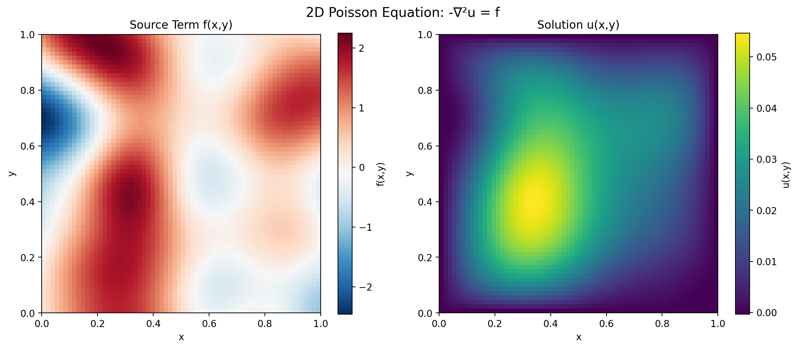

# 2D Poisson Equation Dataset

Numerical solutions to the 2D Poisson equation with Dirichlet boundary conditions using DOLFINx finite element methods.



## Equation

The 2D Poisson equation boundary value problem:

**PDE**: -∇²u = f(x,y)     in Ω = [0, Lx] × [0, Ly]

**Boundary Conditions**: u = 0 on ∂Ω (homogeneous Dirichlet)

## Variables

The dataset returns a dictionary with the following fields:

### Coordinates
- `spatial_coordinates`: (N, 2) - Spatial coordinates as (x, y) pairs

### Solution Fields
- `u_solution`: (N,) - Solution u(x,y) on finite element nodes
- `source_term`: (N,) - Random source function f(x,y)

### Parameters
- `source_strength`: Source term strength scaling factor
- `domain_size`: [Lx, Ly] - Domain dimensions

## Dataset Parameters

- **Domain**: [0, 1] × [0, 1] (unit square)
- **Grid**: 32×32 finite element mesh (P1 triangular elements)
- **Boundary conditions**: Homogeneous Dirichlet (u = 0 on boundary)
- **Source generation**: Gaussian process with random correlation length scales
- **Source amplitude**: Random scaling from 0.5 to 2.0 times base strength

## Physical Context

This dataset simulates steady-state physical systems governed by the 2D Poisson equation.
The equation models phenomena with spatial distributions dependent on source/sink terms:

**Applications**:
- Electrostatic potential in the presence of charge distributions
- Steady-state heat conduction with internal heat sources
- Fluid stream functions for incompressible flow
- Gravitational potential from mass distributions

## Usage

```python
from poisson_dataset import PoissonDataset

# Create dataset
dataset = PoissonDataset()

# Generate a sample
sample = next(iter(dataset))

# Access solution data
spatial_coords = sample["spatial_coordinates"]  # (N, 2) coordinate pairs
solution = sample["u_solution"]                 # u(x,y)
source = sample["source_term"]                  # f(x,y)
```

## Visualization

Run the plotting script to visualize samples:

```bash
python plot_sample.py      # 2-panel visualization of source and solution
```

## Data Generation

Generate the full dataset:

```bash
python generate_data.py
```

This creates train/test splits saved as chunked parquet files in the `data/` directory.